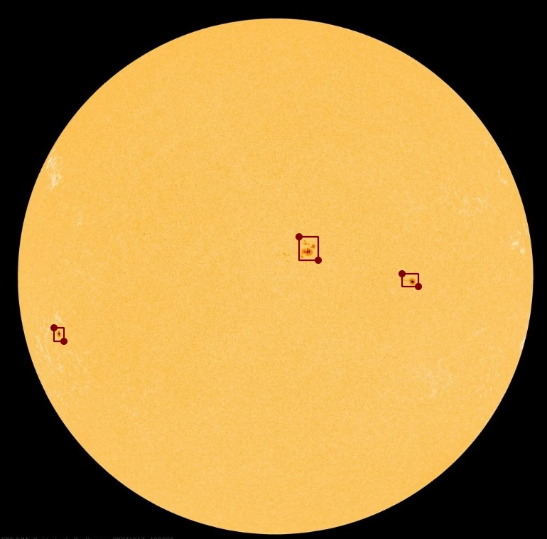

# solar-flare
Machine Learning model for Solar Flare Classification

## Intro
The goal of the ML model is to identify solar flares based on the Enhanced Zurich-McIntosh classification. 

Initially the model will simply classifiy all solar flare activty by grouping or large sunspots. As this model develops it's goal wil be to classify the various groupings. 

See here for an example of the full classification.

https://www.researchgate.net/figure/McIntosh-Sunspot-Group-Classification-Source-McIntosh-1990_fig3_309428017

## Initial image label

## Use of Image Data and code
The images used in this repo are downloaded from the NASA SDO website. See https://sdo.gsfc.nasa.gov/data/rules.php for useage.

Therefore all images provided by SDO NASA are "Courtesy of NASA/SDO and the AIA, EVE, and HMI science teams."

We would like to express our thanks for making these images available to experiement with.

The code and not the images are referred to in the current LICENSE.